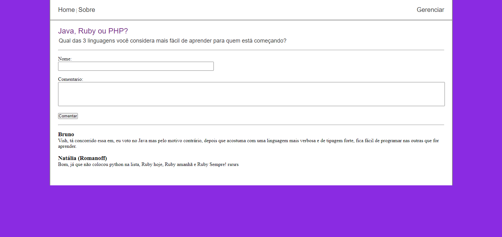

# Postagens


# Sobre o Projeto
Projeto realizado apenas para estudos para compreender mais a respeito de como criar sistemas em padrão MVC (Model, View Controlle) apenas com PHP, 
utilizei como base em uma série de tutoriais no youtube respeito do padrão MVC com este mesmo projeto de postagens. 
#### série de tutoriais mencionado https://www.youtube.com/playlist?list=PLgbAYUnxJ2NE6eM2xkOlpqJ5sl37bLyKx

## Técnologias utilizadas
## Back end
- PHP
- Composer
- Twig
- MySQL
## Front end
- HTML
- CSS
- Javascript

## Layout Web
  

# Como executar o projeto

### pré requisitos: PHP 7 (ou superior) e MySQL
```bash
  # Clonar Repositório
    gh repo clone WilliamD-s/Postagens
   
  # entrar na pasta do projeto
    cd postagens
    
  # criar tabelas no banco MySQL
  - postagem 
      - id INT(4) PK auto_increment
      - titulo VARCHAR (45)
      - conteudo TEXT
    - comentario 
      - id INT(4) PK auto_increment
      - nome VARCHAR (45)
      - mensagem TEXT
      - id_postagem INT(4)
      
  # alterar dentro de app/lib/Database/Connection.php os valores 
    "seu_HOST", "eu_DB", "seu_USUARIO" e "sua_SENHA" para os referentes ao seu banco Mysql criado
   
  # executar o projeto
  php -S localhost
  
  ```
  # Autor
  William de Souza
  
  https://www.linkedin.com/in/william-de-souza-040937194/
